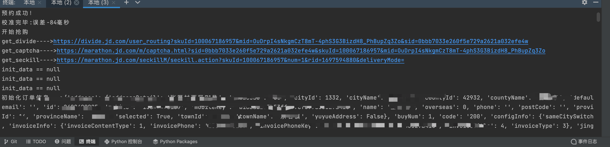
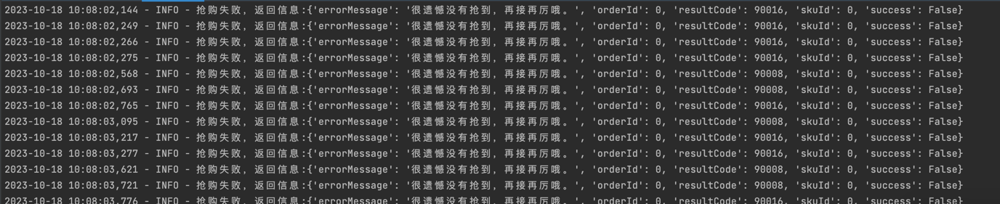
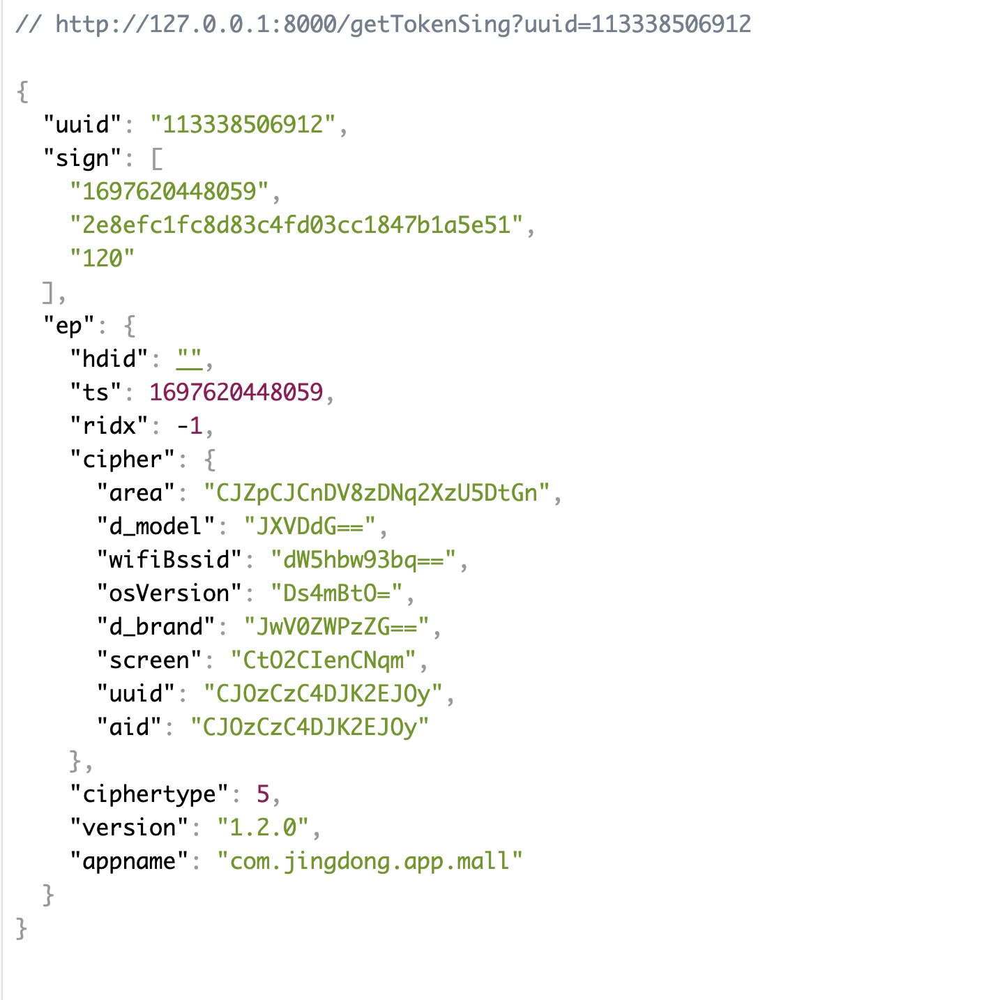

# Jd_seckill_23 By 2023.10.17
# 23年京东茅台，通用抢购，适用于预约流程的抢购

# 2023.10.19
#### 1、这是今天的测试，抢购速度要比昨天好不少，还有提升的空间
#### 2023-10-19 10:08:00,678 - INFO - 抢购失败，返回信息:{'errorMessage': '很遗憾没有抢到，再接再厉哦。', 'orderId': 0, 'resultCode': 90008, 'skuId': 0, 'success': False}
#### 2023-10-19 10:08:00,798 - INFO - 抢购失败，返回信息:{'errorMessage': '很遗憾没有抢到，再接再厉哦。', 'orderId': 0, 'resultCode': 90008, 'skuId': 0, 'success': False}
#### 2023-10-19 10:08:00,924 - INFO - 抢购失败，返回信息:{'errorMessage': '很遗憾没有抢到，再接再厉哦。', 'orderId': 0, 'resultCode': 90008, 'skuId': 0, 'success': False}
#### 2023-10-19 10:08:01,051 - INFO - 抢购失败，返回信息:{'errorMessage': '很遗憾没有抢到，再接再厉哦。', 'orderId': 0, 'resultCode': 90016, 'skuId': 0, 'success': False}
#### 2023-10-19 10:08:01,111 - INFO - 抢购失败，返回信息:{'errorMessage': '很遗憾没有抢到，再接再厉哦。', 'orderId': 0, 'resultCode': 90016, 'skuId': 0, 'success': False}
#### 2、这里说下，demo里面已经是个完整的流程了，如果不清楚的可以抓包看看，参数里面涉及加密的代码跟包是不会提供的，因为避免大量传播，这边后续会搭建服务器把加密接口提供给大家用，
#### 3、TODO....

# 2023.10.18
####  1、这边今天测试了一下华为mete60，

这边在测试过程中发现第一次提交订单都时间总是会有差，因为抢购队列你越早提交请求概率就越大，如果有办法解决可以大大提高概率
#### 2、这边说下，初始化订单都接口数据提前请求是拿不到数据的所以想要很精准的卡点是比较难的
#### 3、目前在想着一块的解决方案，如果有感兴趣的小伙伴可以在issues留下联系方式
#### 4、提供一个获取sign的接口

# 2023.10.17 目前抢购的流程是这样的 
#### 1、通过获取tokenKey拿到跳转链接
#### 2、访问跳转链接，会经过两次302跳转，拿到请求头中的ck
#### 3、请求初始化订单接口生成提交订单的数据
#### 4、请求下单接口

##下单后，下面有几种验证码情况
| 90008   |
|---------|
| 90013   |
| 90016   |
| 90017   |
| 90019   |

## 以下是我经过大量测试总结的验证码经验
#### 1 、90013 、 90017，参数不正确或者参数不全的时候会出现，正常情况是不会出现的，因为init_order的时候会获取到token，订单的参数也是这个时候初始化好的
#### 2、 90008，这种验证码有很多种情况，有人猜跟京东信用积分有关系，不排除会有这种需求，但是更多的还是无效请求，比如抢购队列的消息上限直接被拒绝，或者是ip限制，请求头限制之类的限流返回，大家可以做个测试，在开启抢购前30秒的时候这个验证码出现的概率不大，基本都是90016
#### 3、 90016，这个验证码也是很常见的，大概率是竞争锁失败后的返回，
#### 4、 90019，这个遇到的比较少，怀疑是抢到锁以后某些错误的返回

# jdMs这个文件是个demo，里面一些具体的参数可以通过抓包获取，关于一些具体的算法问题，源码不方便展示，后续会做成api供大家使用，如果有问题可以在 issues联系